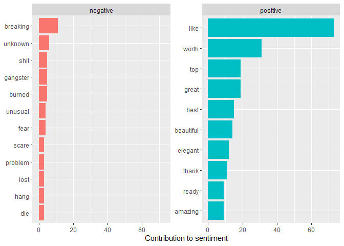

<!-- README.md is generated from README.Rmd. Please edit that file -->

# texter

<!-- badges: start -->
<!-- badges: end -->

The goal of texter is to help simplify text analysis for data
professionals who need quick insights into their text data.

## Installation

This package is in its testing phasing and as not been submitted to
CRAN.
<!-- You can install the released version of texter from [CRAN](https://CRAN.R-project.org) with: -->

<!-- ``` r -->
<!-- install.packages("texter") -->
<!-- ``` -->

The development version from [GitHub](https://github.com/) can be
installed with:

    # install.packages("devtools")
    #devtools::install_github("simmieyungie/texter")
    remotes::install_github("simmieyungie/texter@main")
    #remove.packages(texter)

## Example

This is a basic example which shows you how to solve a common problem:

    library(texter)
    ## basic example code

### Users

This will help you extract all the handles tagged in a tweet.


    head(unlist(users(doge$text)),5)
    #> [1] "@ConanOBrien:"     "@AdrianoCollalti:" "@BitcoinBarry1"    "@allyATL"         
    #> [5] "@trust_in_andre"

### Sentiment Analyzer

The emotions conveyed tweets using sentiment analysis. You have an
option to specify **details = TRUE (or FALSE)**. TRUE will return a more
robust distribution of sentiments and not just **Positive or Negative**.

    sentimentAnalyzer(doge$text, details = T)
    #> Joining, by = "word"
    #> Joining, by = "word"
    #> # A tibble: 9 x 2
    #>   sentiment        n
    #>   <chr>        <int>
    #> 1 anger           86
    #> 2 anticipation   205
    #> 3 disgust          5
    #> 4 fear            53
    #> 5 joy            190
    #> 6 negative        35
    #> 7 positive       210
    #> 8 surprise         6
    #> 9 trust           31

Specifying details = F

    sentimentAnalyzer(doge$text, details = F)
    #> Joining, by = "word"
    #> Joining, by = "word"
    #> # A tibble: 2 x 2
    #>   sentiment     n
    #>   <chr>     <int>
    #> 1 negative    123
    #> 2 positive    348

### top\_words

Extract the top n words occurring in a text


    top_words(word_vec = brexit$content, remove_these = c("london", "since"),
              size = 10)
    #> Joining, by = "word"
    #> Selecting by n
    #>        word   n
    #> 1     chars 100
    #> 2   reuters  99
    #> 3   graphic  54
    #> 4    brexit  45
    #> 5  sterling  43
    #> 6      staf  36
    #> 7  european  31
    #> 8     rates  29
    #> 9      vote  29
    #> 10    world  28

### Counter

Retrieve the frequency of a word from a text.

    counter(word_vec = brexit$content, words = c("brexit", "london"))
    #>      key  n
    #> 1 brexit 54
    #> 2 london 69

### top\_sentiments

Retrieve the top 10 positive and negative words. Specify plot = TRUE and
a simple bar chart of the words will be created, otherwise you get a
dataframe of results.

    top_Sentiments(word_vec = brexit$content, plot = F)
    #> Joining, by = "word"
    #> Joining, by = "word"
    #> # A tibble: 54 x 3
    #> # Groups:   sentiment [2]
    #>    word        sentiment     n
    #>    <chr>       <chr>     <int>
    #>  1 delays      negative      3
    #>  2 slow        negative      3
    #>  3 slump       negative      3
    #>  4 burning     negative      2
    #>  5 proprietary negative      2
    #>  6 protests    negative      2
    #>  7 anger       negative      1
    #>  8 bleak       negative      1
    #>  9 bomb        negative      1
    #> 10 casualty    negative      1
    #> # ... with 44 more rows

    top_Sentiments(word_vec = doge$text, plot = T) #You can further customize your plot
    #> Joining, by = "word"
    #> Joining, by = "word"



### top\_words\_retriever

Retrieve the top n words occurring in a rows of data containing a
certain word


    top_words_Retriever(word_vec = brexit$content, word_ret = "brexit",
                        remove_these = c("eu", "rt"), size = 10)
    #> Joining, by = "word"
    #>        word  n
    #> 1     rters 55
    #> 2   graphic 54
    #> 3     chars 53
    #> 4    brexit 45
    #> 5  sterling 42
    #> 6    london 39
    #> 7     since 30
    #> 8     rates 29
    #> 9      vote 29
    #> 10    world 28
